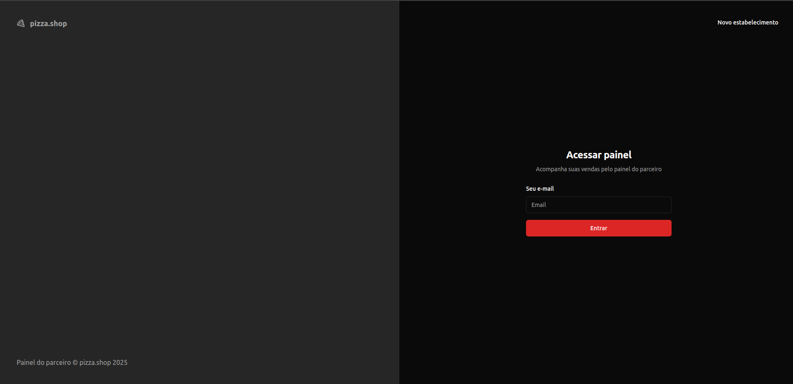
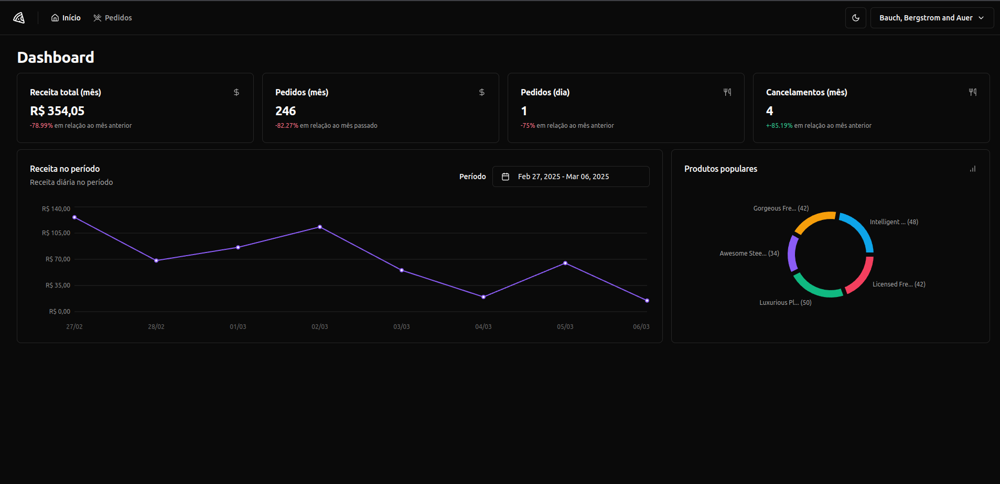
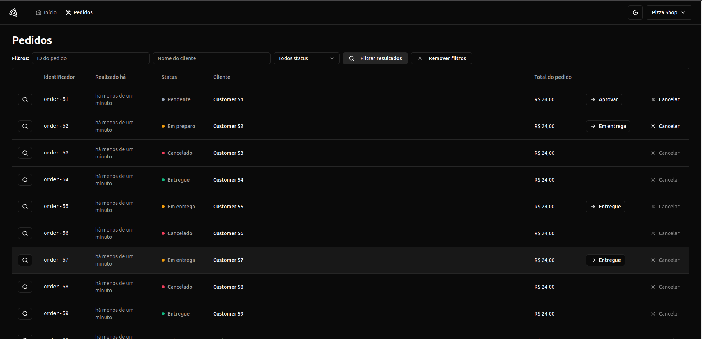

# Pizza Shop Project
This project consists of two main parts:

## 📱 Web Application (`/web`)
A React-based web interface for pizza shop management.

## 🚀 API (`/api`) 
A backend REST API that serves the web application.

### Getting Started

1. Enter each directory separately
2. Follow the setup instructions in their respective README files

```bash
# For the web application
cd web

# For the API
cd api
```

### 🔧 Technologies Used

### Web Application
- React.js with TypeScript
- Tailwind CSS for styling
- React Router DOM for navigation
- React Hook Form for form handling
- Zod for form validation
- React Query for data fetching
- Axios for HTTP requests

-----

### Testing Libraries

Para garantir a qualidade do código, utilizamos as seguintes ferramentas:

[](https://vitest.dev/) - Framework de testes unitários rápido e moderno, similar ao Jest

[](https://testing-library.com/) - Biblioteca para testar componentes React de forma mais próxima ao usuário real

[](https://testing-library.com/docs/ecosystem-jest-dom/) - Extensão/plugin da `Testing Library` com matchers personalizados para testar elementos DOM

[](https://playwright.dev/) - Framework para testes end-to-end (E2E) automatizados

[](https://mswjs.io/) - Mock Service Worker para interceptar e simular chamadas de API em testes

Plugins adicionais:

[](https://github.com/jsdom/jsdom) - Implementação do DOM para ambiente Node.js, permitindo testar código browser-like

[](https://testing-library.com/docs/user-event/intro/) - Biblioteca para simular interações do usuário em testes

----

### API
- Bun.js with TypeScript
- Zod for validation
- JWT for authentication

----

### 📸 Screenshots

<div style="display: flex; gap: 10px;">
    
    
    
</div>